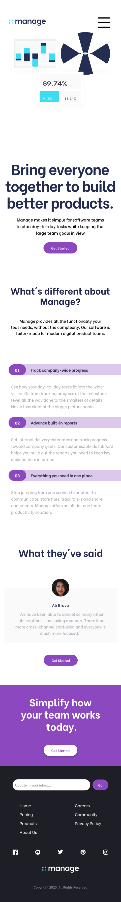
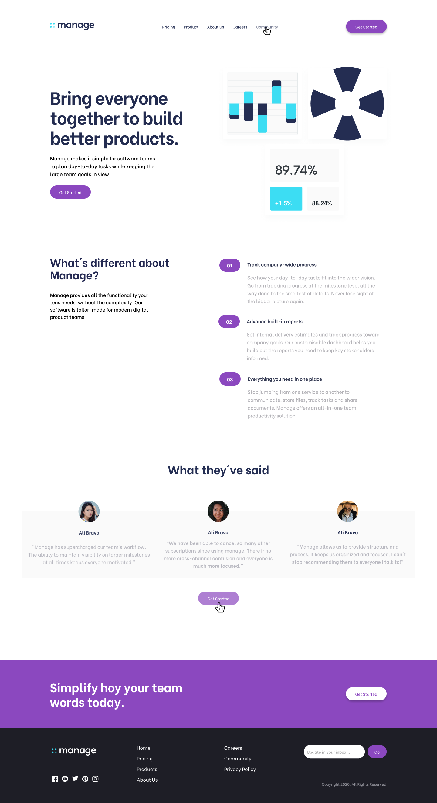
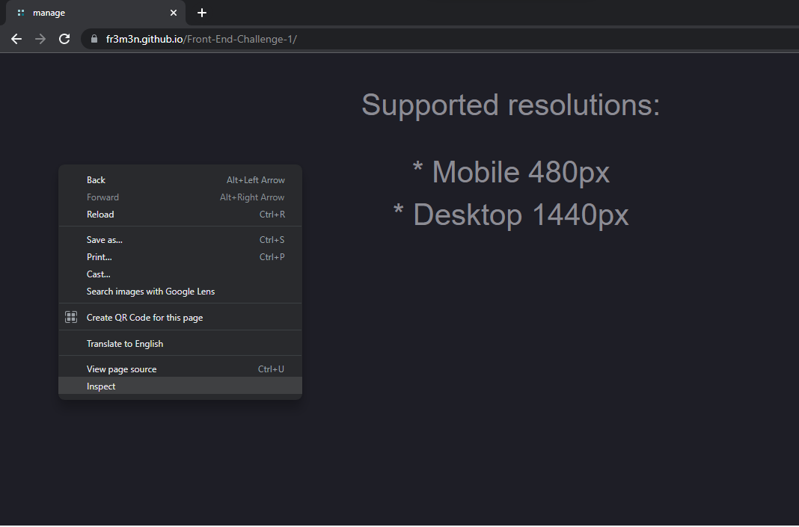
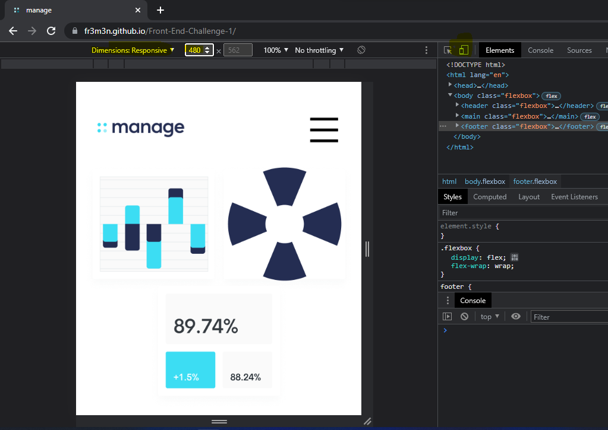
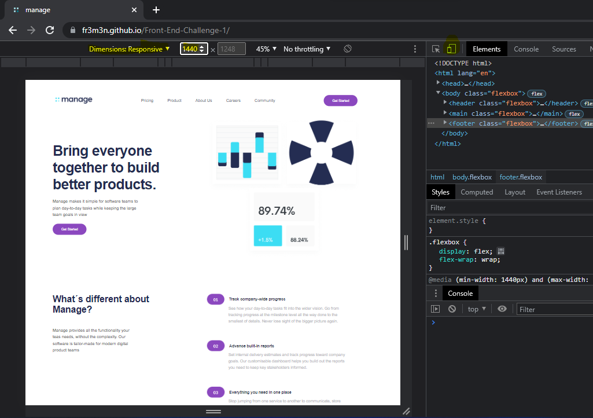

# ::MANAGE
***

### Front-End Challenge (HTML + CSS only)

> #### HTML and semantic tagging:
> - *`header`*
> - *`main`*
> - *`footer`*

> - *`nav`bar*
> - *`article`*
> - *`section`*

> #### Responsive web design.
>> ##### Media queries:
>> - *Mobile  -> 480px*
>>
>>    
>>
>> - *Desktop -> 1440px*
>>
>>    

> #### Correct use of:

> - *HTML Links - Hyperlinks
> - *HTML Form*
> - *HTML Buttons*

> - *CSS Descendant selectors*
> - *CSS Flexbox Layout Module*
> - *CSS Pseudo-elements & Pseudo-Classes*
> - *CSS Animations - @keyframes*
> - *CSS CARDS*

> - *Images, icons, fonts, background.*

[FIGMA](https://www.figma.com/file/iII0s16x1QBl77oSuyXRrg/Frontend-1-Septiembre-22?node-id=0%3A1)

Go to: 
[MANAGE](http://stellinelab.com/manage/root/index.html)

* Right-click on a webpage, then `Inspect`.

    

* Click the device icon in the Developer Tools window’s top left corner to activate device mode.
* Set the width to 480px or 1440px 

    
    

contact:
<contact@stellinelab.com>